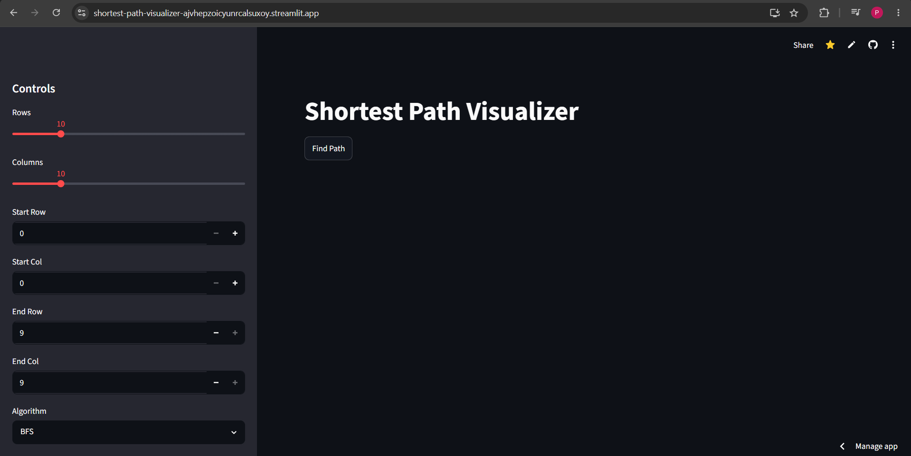
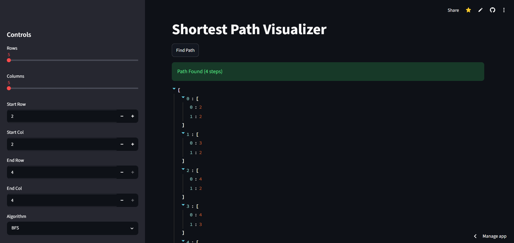
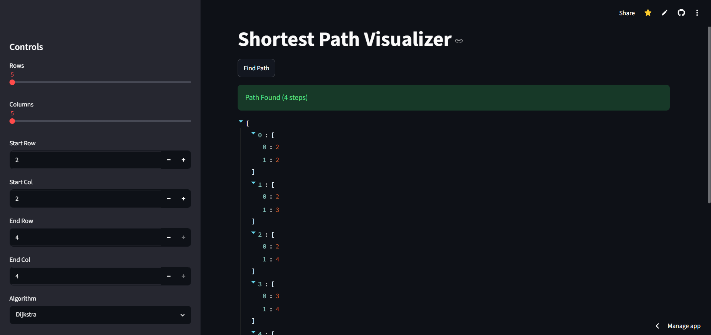
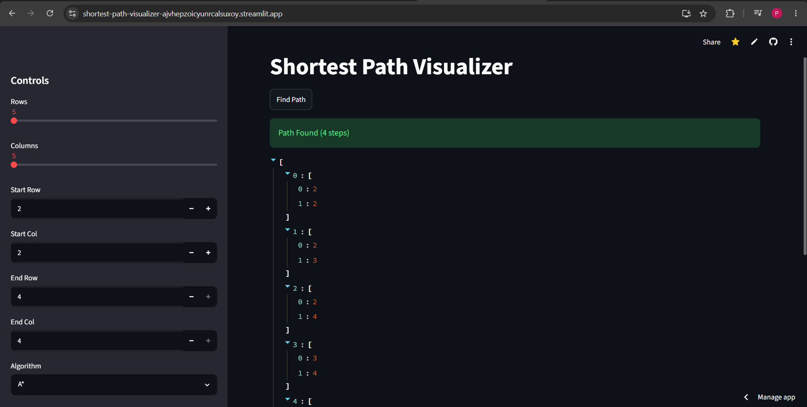
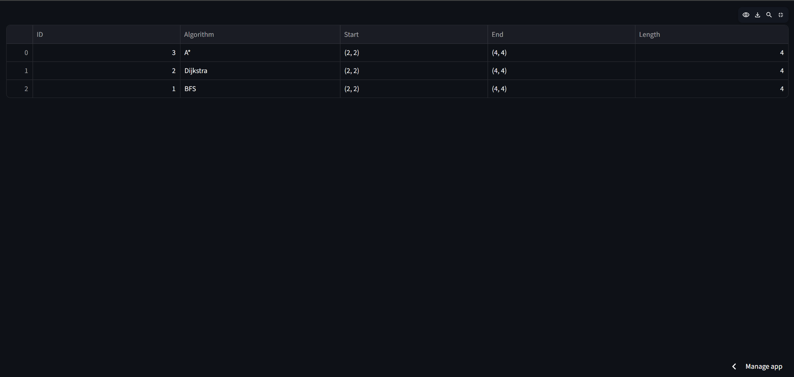

# Shortest Path Visualizer

## Overview

Shortest Path Visualizer is a beginner-friendly DSA project developed to understand graph traversal and pathfinding algorithms. The application allows users to visualize and compare BFS, Dijkstra, and A* algorithms on a configurable grid using an interactive Streamlit interface.

## Features

* Implemented BFS for shortest path discovery in unweighted grids.
* Implemented Dijkstra's Algorithm for weighted shortest path computation.
* Implemented A* Search using Manhattan Distance heuristic.
* Interactive grid size configuration from 5x5 to 30x30.
* SQLite database integration for storing execution history.
* Streamlit-based user interface for real-time visualization.

## Tech Stack

* Python
* Streamlit
* SQLite
* Pandas

## Key Learnings

* Graph Traversal Algorithms
* Queue and Priority Queue Operations
* Heuristic-Based Search
* Database Integration
* Streamlit Deployment

## Sample Metrics

* Supports grids containing up to 900 nodes.
* Processes pathfinding operations in under 1 second for standard test cases.
* Stores execution history for all algorithm runs.
* Compares three pathfinding algorithms within a single interface.

## Future Enhancements

* Obstacle Generation
* Weighted Grids
* Animated Path Visualization
* Exportable Search Reports

## Deployment

The application is deployed using Streamlit Cloud and can be accessed through the live deployment link.

## Project Output

### Home Page

### BFS Result

### Dijkstra Result

### A* Result

### History Table

